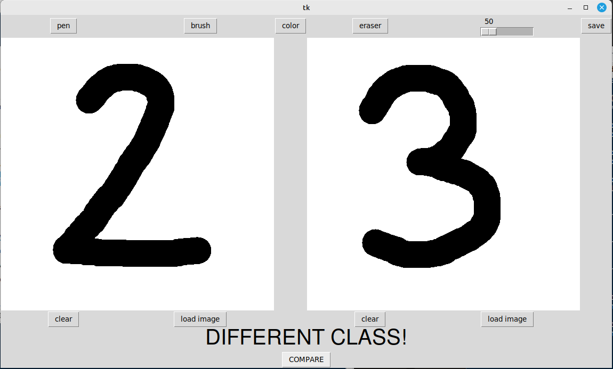
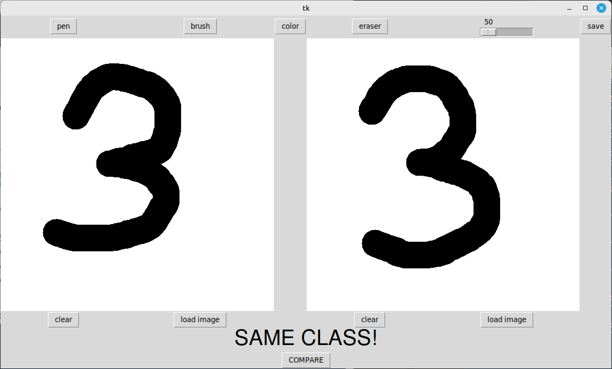

# Similarity-image-Canvas
Useful script for graphically testing similarity or comparison models, in the demo the models were trained using my Siamese Network implementation with triplet loss.
## Screen

